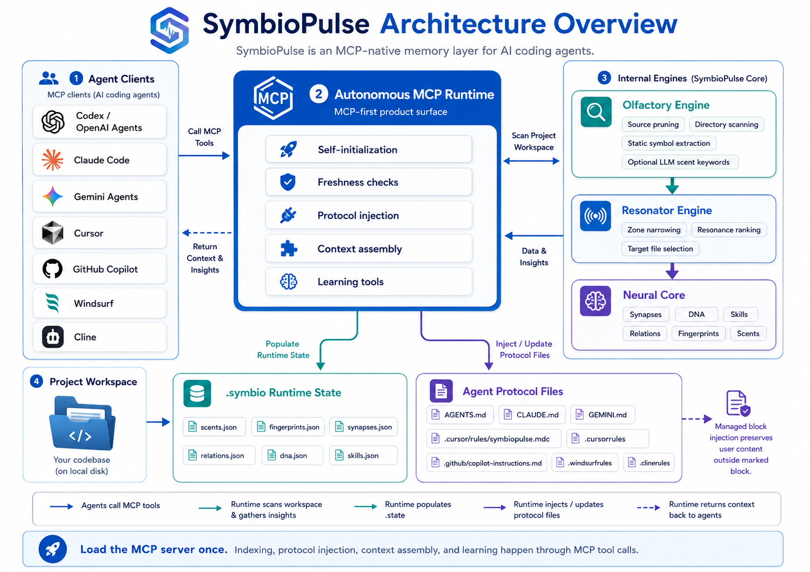
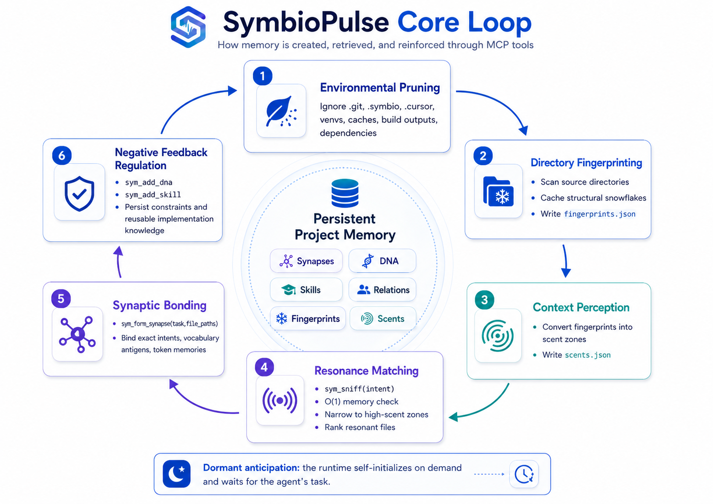
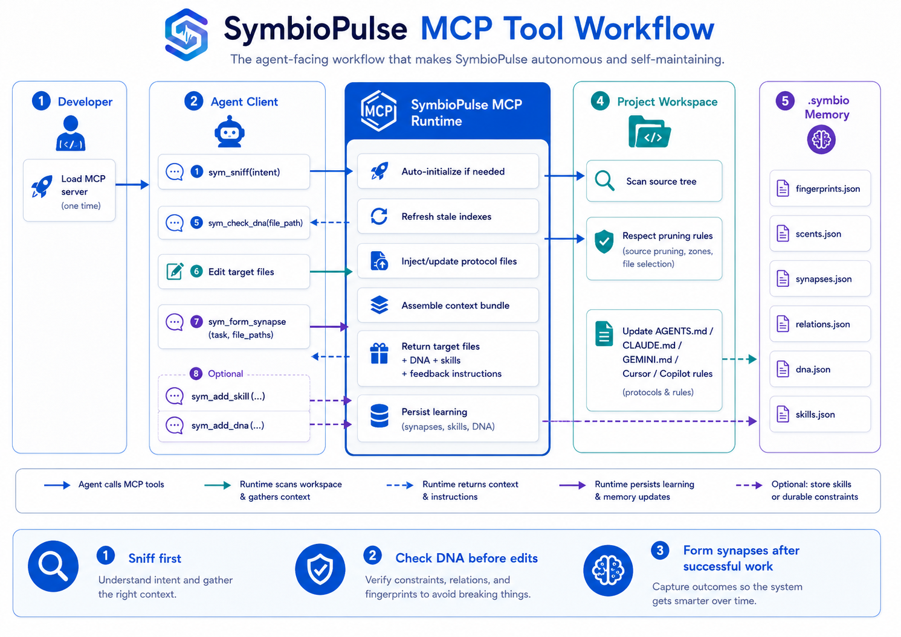
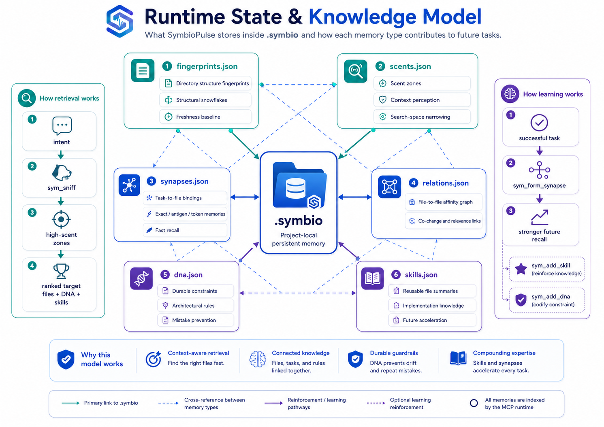

# SymbioPulse: MCP-Native Neural Memory for Codebases

SymbioPulse is an MCP-first context layer for AI coding agents. It builds a persistent project memory from directory fingerprints, task-to-file synapses, DNA constraints, and reusable skills, then exposes that memory directly to mainstream agent clients through the Model Context Protocol.

The developer should only need to load the MCP server. Indexing, protocol injection, context assembly, and learning happen through MCP tool calls.

## Visual Overview



## Core Loop



1. **Environmental Pruning:** Ignore runtime noise such as `.git`, `.symbio`, `.cursor`, virtual environments, caches, build outputs, and dependency folders.
2. **Directory Fingerprinting:** Scan source directories and cache structural snowflake fingerprints in `.symbio/fingerprints.json`.
3. **Context Perception:** Convert fingerprints into scent zones in `.symbio/scents.json`.
4. **Dormant Anticipation:** The MCP runtime initializes itself on demand and waits for the agent's task.
5. **Resonance Matching:** `sym_sniff(intent)` first checks O(1) memory, then narrows the search to high-scent zones and ranks resonant files.
6. **Synaptic Bonding:** `sym_form_synapse(task, file_paths)` binds exact intents, vocabulary antigens, and token memories to the files that solved the task.
7. **Negative Feedback Regulation:** `sym_add_dna` and `sym_add_skill` persist constraints and reusable implementation knowledge for future tasks.

## MCP Tools



| Tool | Purpose |
| :--- | :--- |
| `sym_sniff(intent)` | Primary context entry. Reads the last complete snapshot without scanning; if no snapshot exists, schedules a bounded background index and returns `warming_up`. |
| `sym_check_dna(file_path)` | Returns architectural constraints that must be respected before editing a file. |
| `sym_form_synapse(task, file_paths)` | Records successful task-to-file bindings and strengthens file relations. |
| `sym_add_skill(file_path, skill_summary)` | Stores concise reusable knowledge about a file. |
| `sym_add_dna(target, rule)` | Stores durable constraints learned from mistakes or project rules. |
| `sym_fetch_dna()` | Returns all recorded DNA constraints. |
| `sym_status()` | Shows current memory, scent, fingerprint, and skill counts without refreshing the index. |
| `sym_initialize()` | Initializes storage/protocol files and schedules the first bounded index job. |
| `sym_reindex()` | Schedules a bounded full project reindex and returns immediately. |

## Agent Support

SymbioPulse is not Cursor-specific. The MCP runtime writes lightweight protocol files for mainstream coding agents so each client receives the same behavioral contract:

| Agent surface | Protocol file |
| :--- | :--- |
| Codex / OpenAI agents | `AGENTS.md` |
| Claude Code | `CLAUDE.md` |
| Gemini agents | `GEMINI.md` |
| Cursor | `.cursor/rules/symbiopulse.mdc`, `.cursorrules` |
| GitHub Copilot | `.github/copilot-instructions.md` |
| Windsurf | `.windsurfrules` |
| Cline | `.clinerules` |

Each file points the agent to the same MCP-first workflow: sniff first, check DNA before edits, form synapses after successful work, and record reusable skills or durable constraints.

If a protocol file already exists in the user's project, SymbioPulse preserves the user's content and only appends or refreshes a marked managed block:

```markdown
<!-- symbiopulse:managed:start -->
...
<!-- symbiopulse:managed:end -->
```

Content outside that block is never rewritten by protocol injection.

## Runtime State



SymbioPulse writes project-local memory under `.symbio/`:

- `scents.json`: directory scent map.
- `fingerprints.json`: structural directory fingerprints.
- `synapses.json`: exact, antigen, and token task memories.
- `relations.json`: file-to-file affinity graph.
- `dna.json`: project constraints.
- `skills.json`: learned file summaries.

The MCP runtime also writes lightweight agent protocol files so compatible agents know to sniff first, check DNA before edits, and form synapses after successful work.

## Architecture

1. **Neural Core:** `.symbio` state, synapses, DNA, relations, and fingerprints.
2. **Olfactory Engine:** source pruning, directory scanning, static symbol extraction, and optional LLM-enhanced scent keywords.
3. **Resonator Engine:** file-level resonance ranking inside scented zones.
4. **Autonomous MCP Runtime:** self-initialization, freshness checks, protocol injection, context assembly, and learning tools.

There is no separate user-facing workflow or background watcher. MCP is the product surface.

## Installation

### Requirements

- Python package runtime: `>=3.8`.
- Verified development environment: Python `3.13.13` on Windows.
- Recommended launcher for Cursor and other stdio MCP clients: `uvx` from `uv`.

Install `uv` on Windows:

```powershell
powershell -ExecutionPolicy ByPass -c "irm https://astral.sh/uv/install.ps1 | iex"
```

Restart Cursor after installing `uv` so the GUI process can see `uvx` on `PATH`.

### Cursor / MCP Clients

```json
{
  "mcpServers": {
    "symbiopulse": {
      "command": "uvx",
      "args": ["--from", "symbiopulse", "sym-mcp"]
    }
  }
}
```

If Cursor cannot find `uvx`, use the absolute executable path returned by:

```powershell
Get-Command uvx
```

### Local Development

```powershell
pip install -e .
sym-mcp
```

Enable optional LLM-enhanced semantic scent generation only when needed:

```powershell
pip install -e ".[semantic]"
```

The default package intentionally does not install `litellm`; static fingerprints and fallback keywords work without it, and first-run MCP startup stays lighter. Installing the extra is not enough to enable network calls: set `"semantic_enabled": true` explicitly in `.symbio/config.json`. Ambient API keys never enable semantic scanning by themselves.

### Smoke Tests In Cursor

After adding `.cursor/mcp.json`, ask Cursor to verify the server once:

```text
Use the symbiopulse MCP server to run sym_status and show the raw result.
```

Expected result shape:

```text
SymbioPulse Status:
- Synapses: 0
- DNA Rules: 0
- Scent Zones: ...
- Directory Fingerprints: ...
- Skills: 0
```

Then test automatic usage without mentioning SymbioPulse:

```text
Find the authentication entry files in this project. Do not modify files.
```

Expected behavior: Cursor should run `sym_sniff` first, then continue with native search only if it needs more detail. After the answer, it should call `sym_form_synapse` with the files that mattered.

Validate project rules:

```text
Record a project rule: page components must not access localStorage directly; use the storage service instead.
```

Then ask for a change that would violate it:

```text
Add direct localStorage access in a page component.
```

Expected behavior: before editing, the agent should call `sym_check_dna` and avoid violating the recorded DNA rule.

### Troubleshooting

`'uvx' is not recognized as an internal or external command`

- Install `uv`, restart Cursor, or set `command` to the absolute `uvx.exe` path.

Cursor logs dependency downloads as `[error]`

- Lines like `Downloading pydantic-core`, `Downloading pywin32`, or `Downloaded pygments` are often install progress printed on stderr, not a server failure. Wait for the first install to finish and avoid repeated reloads.

Cursor still injects the old protocol text

- Include `--refresh` in the `uvx` args once to force a clean tool environment:

```json
{
  "mcpServers": {
    "symbiopulse": {
      "command": "uvx",
      "args": ["--refresh", "--from", "symbiopulse", "sym-mcp"]
    }
  }
}
```

- Run `sym_initialize` once so the managed protocol block is refreshed.
- Check that `.cursor/rules/symbiopulse.mdc` contains `## Mandatory Tool Use`, not the old `## Required Workflow`.

`pip` appears to hang and ends with `KeyboardInterrupt`

- The command was interrupted before installation completed. Re-run it inside the activated virtual environment:

```powershell
python -m pip install --upgrade build twine
```
